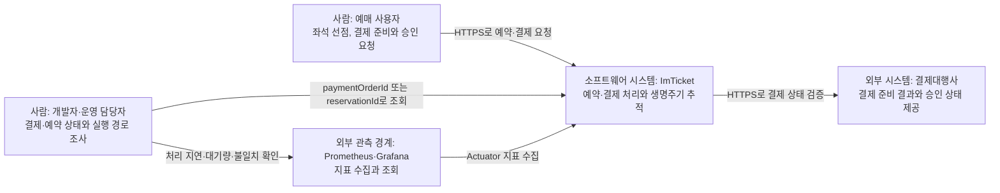
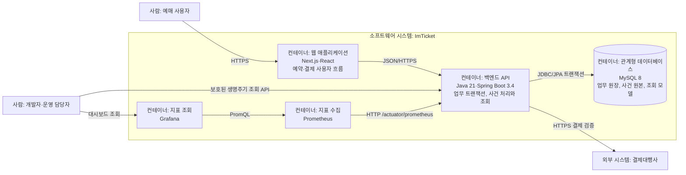
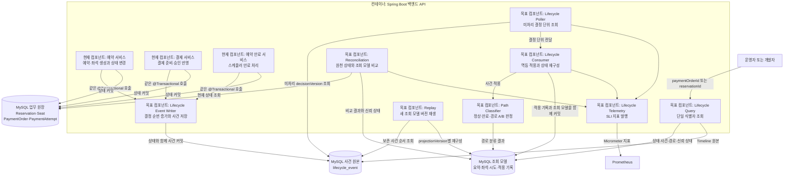
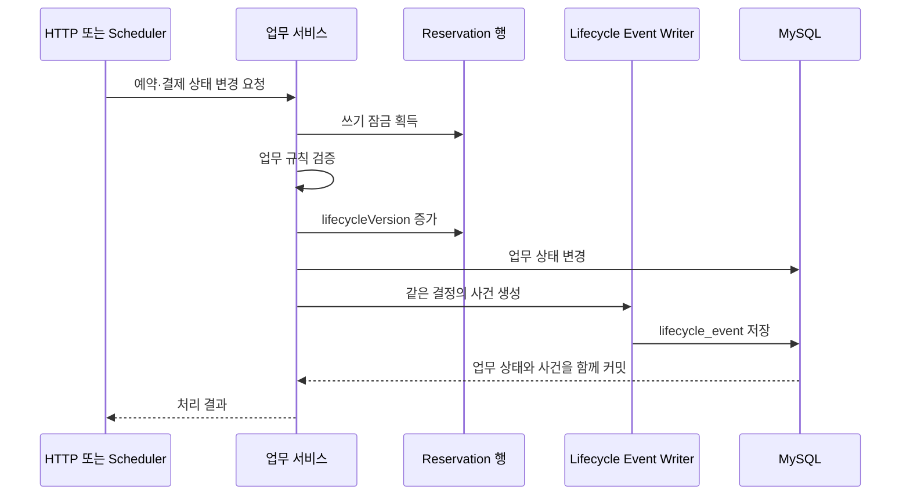
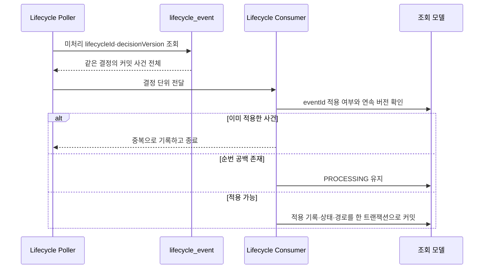
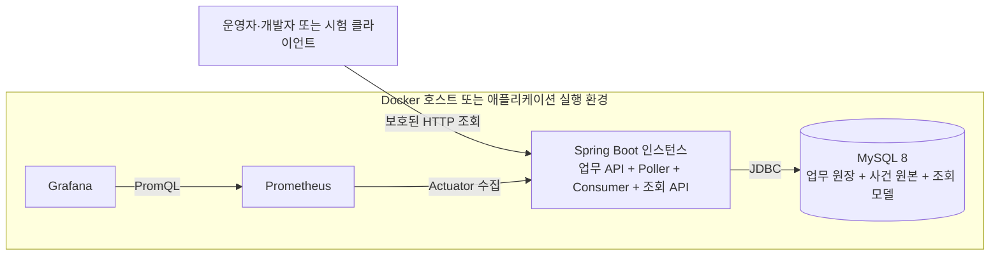

# 예약·결제 생명주기 추적 C4 아키텍처

작성일: 2026-09-20(KST)  
상태: 승인된 목표 구조, 구현 전  
기준 코드: `develop`, `47f97298cebf0fa3426a464d87b6b88b4b8e88b2`  
관련 문서: [문서 지도](README.md) · [요구사항](requirements.md) · [기술 선택 ADR](phase-1-technology-adr.md) · [데이터 모델과 ERD](data-model-erd.md) · [재구성 명세](lifecycle-reconstruction-spec.md)

## 1. 범위와 표기

이 문서는 예약·결제 생명주기 추적 기능을 다음 세 수준으로 표현한다.

1. 시스템 컨텍스트: 사용자·운영자·외부 결제대행사와 ImTicket의 관계
2. 컨테이너: Spring Boot 애플리케이션, MySQL과 관측 시스템의 관계
3. 컴포넌트: 사건 생성, 폴링, 상태 재구성, 조회, 원천 대조와 재처리 책임

C4의 컨테이너는 실행 가능한 애플리케이션 또는 데이터 저장소 단위다. 생명주기 Poller와 Consumer는 초기 구조에서 별도 서비스가 아니며 기존 Spring Boot 애플리케이션 안의 컴포넌트다.

다이어그램의 `현재`는 코드에서 확인된 구조, `목표`는 ADR로 승인된 구현 구조를 뜻한다.

## 2. 시스템 컨텍스트

생명주기 추적의 업무 경계는 ImTicket 내부에서 커밋된 상태 변경이다. 결제대행사의 승인 사실은 결제 검증을 거쳐 `PaymentAttempt`에 커밋된 시점부터 내부 업무 사건으로 취급한다.

## 3. 컨테이너

### 컨테이너 책임

| 컨테이너 | 현재 책임 | 생명주기 추적 목표 책임 |
| --- | --- | --- |
| 웹 애플리케이션 | 예약·결제 사용자 흐름 | MVP 조회 화면은 범위에서 제외 |
| 백엔드 API | 예약·좌석·결제 트랜잭션과 만료 작업 | 사건 생성, Poller, Consumer, 조회, 원천 대조, 재처리 |
| MySQL | 업무 상태의 원천 | `lifecycle_event`, 적용 기록, 조회 모델과 원천 대조 결과 저장 |
| Prometheus·Grafana | 애플리케이션 지표 수집·조회 | 사건 수, 처리 지연, 처리 대기량, 복구와 불일치 지표 수집·조회 |

Redis는 예약·결제 생명주기 사건의 원본과 조회 모델에 사용하지 않는다. 초기 구조의 원자성, 재처리와 원천 대조는 MySQL 경계에서 검증한다.

## 4. 백엔드 API 컴포넌트

## 5. 핵심 실행 흐름

### 5.1 사건 생성과 커밋

사건 저장에 실패하면 업무 트랜잭션도 실패한다. 멱등 재응답에서 새 상태 변경이 없으면 새 업무 사건도 생성하지 않는다.

### 5.2 폴링과 멱등 적용

Poller는 아웃박스 기본 키의 최댓값을 체크포인트로 사용하지 않는다. 미처리 상태와 적용 기록을 기준으로 사건을 찾는다. 초기 구현은 ShedLock으로 Poller 하나를 실행한다.

### 5.3 원천 대조와 재처리

- 원천 대조는 예약, 연결된 모든 좌석, 결제 주문과 모든 결제 시도의 현재 상태를 조회 모델과 비교한다.
- 조회 모델 버전이 원천보다 낮고 필요한 사건이 모두 있으면 `PROCESSING`으로 판정한다.
- 원천 버전까지 필요한 사건이 없으면 `INCOMPLETE`, 같은 버전의 상태가 다르면 `MISMATCH`로 판정한다.
- 재처리는 다른 `projectionVersion`의 빈 조회 모델에 보존 사건을 순서대로 적용한다.

## 6. 데이터 책임과 트랜잭션 경계

| 데이터 | 책임 | 쓰기 경계 | 변경 정책 |
| --- | --- | --- | --- |
| Reservation·Seat·PaymentOrder·PaymentAttempt | 업무 원장 | 기존 업무 트랜잭션 | 도메인 규칙과 잠금으로 변경 |
| `lifecycle_event` | 커밋된 업무 사건 원본 | 업무 원장과 같은 트랜잭션 | 업무 필드는 생성 후 수정하지 않음 |
| 사건 적용 기록 | 중복 제거와 처리 상태 | 조회 모델 갱신과 같은 Consumer 트랜잭션 | `eventId` 유일성 보장 |
| 생명주기 조회 모델 | 재구성된 현재 상태·경로 | Consumer 트랜잭션 | 사건 원본에서 재생 가능 |
| 원천 대조 결과 | 신뢰 상태와 필드 차이 | 원천 대조 트랜잭션 | 마지막 대조 시각과 근거 보존 |

## 7. 배포 관점

초기 배포는 기존 Spring Boot 애플리케이션과 MySQL을 그대로 사용한다.

여러 애플리케이션 인스턴스를 실행할 때 ShedLock이 Poller 하나를 선택한다. 처리량 또는 독립 배포 요구가 ADR의 재검토 조건을 충족하면 Poller 전달 경계를 Kafka·Debezium과 다시 비교한다.

## 8. 현재 상태와 구현 순서

| 구성 요소 | 상태 | 구현 Phase |
| --- | --- | --- |
| 예약·결제·만료 업무 서비스와 MySQL 원장 | 현재 구현 | 선행 기반 |
| 기준선과 요구사항 | 작성 완료 | Phase 0 |
| 기술 선택과 목표 아키텍처 | 승인 | Phase 1 |
| `lifecycle_event`와 Event Writer | 구현 완료 | Phase 2 |
| Poller와 Consumer | Consumer·Poller 코드 완료, 기본 비활성 | Phase 3~4 |
| 조회 모델과 경로 분류 | 구현 완료 | Phase 3 |
| 지연·장애 처리와 재처리 | 구현 전 | Phase 4 |
| 조회 API와 원천 대조 | 구현 전 | Phase 5 |

테이블, 키, 제약과 인덱스는 [데이터 모델과 ERD](data-model-erd.md)를 따른다. 코드 패키지, API 경로와 권한 계약은 각 구현 Phase의 세부 설계에서 확정한다. 컴포넌트의 책임과 데이터 경계가 바뀌면 이 문서와 ADR을 함께 갱신한다.
