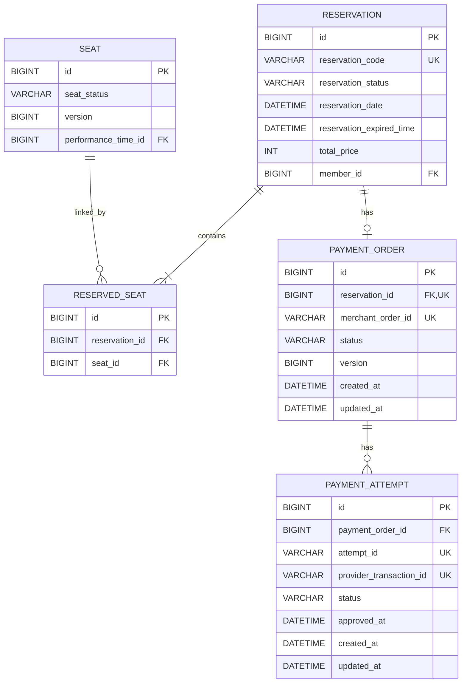
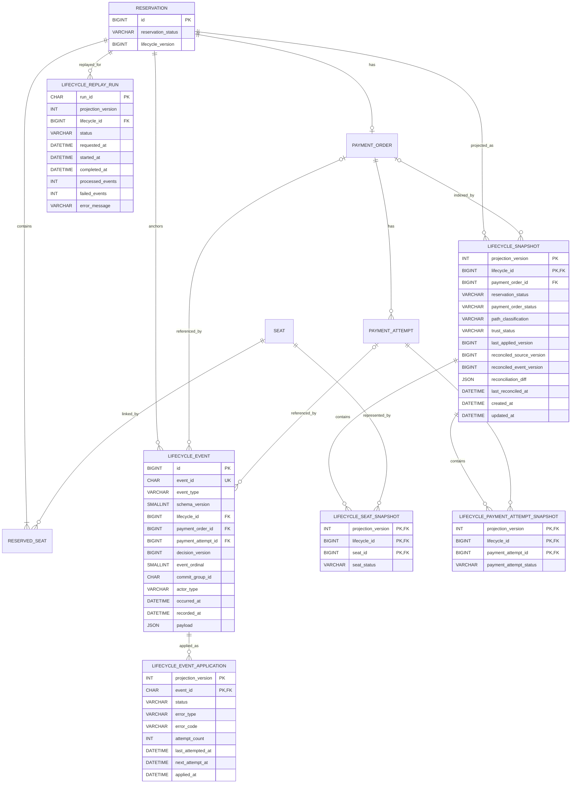

# 예약·결제 생명주기 추적 데이터 모델과 ERD

작성일: 2026-09-20(KST)  
상태: Phase 4 복구·대조 구현 반영  
기준 코드: `develop`, `47f97298cebf0fa3426a464d87b6b88b4b8e88b2`  
관련 문서: [문서 지도](README.md) · [요구사항](requirements.md) · [기술 선택 ADR](phase-1-technology-adr.md) · [재구성 명세](lifecycle-reconstruction-spec.md)

## 1. 왜 이 데이터 모델이 필요한가

[현재 추적 기준선](baseline.md)은 결제 한 건의 원인을 설명하려면 5개 테이블 조회, 로그 검색 4회와 식별자 6종이 필요함을 확인했다. 현재 원장 테이블은 Reservation, Seat, PaymentOrder와 PaymentAttempt의 최종 상태를 저장한다. 다음 사실은 저장하지 않는다.

- 어느 처리 주체가 상태 변경을 결정했는가
- 어떤 상태 변경들이 같은 트랜잭션에서 커밋됐는가
- 같은 예약의 결정 순서는 무엇인가
- 최종 상태가 경로 A와 B 중 어느 경로에서 만들어졌는가
- 조회 모델이 원천 상태와 마지막으로 일치한 시점은 언제인가

목표 모델은 업무 원장, 커밋 사건 원본, 재생 가능한 조회 모델을 분리한다. 운영자는 조회 모델을 사용하고, 정확성 검증과 재처리는 사건 원본을 사용한다.

## 2. 현재 데이터 모델

### 2.1 현재 ERD



### 2.2 확인 근거

현재 MySQL `SHOW CREATE TABLE`과 다음 Entity를 대조했다.

- [Reservation](../../src/main/java/org/example/ticket/reservation/booking/domain/Reservation.java)
- [ReservedSeat](../../src/main/java/org/example/ticket/reservation/booking/domain/ReservedSeat.java)
- [Seat](../../src/main/java/org/example/ticket/reservation/booking/domain/Seat.java)
- [PaymentOrder](../../src/main/java/org/example/ticket/payment/model/PaymentOrder.java)
- [PaymentAttempt](../../src/main/java/org/example/ticket/payment/model/PaymentAttempt.java)

`payment_order.reservation_id`에는 고유 제약이 있어 예약 하나에 결제 주문은 최대 하나다. `payment_attempt`는 결제 주문 하나에 여러 행을 허용한다. `ReservedSeat`가 예약과 좌석의 연결을 보존한다.

현재 데이터 모델에는 상태 변경 이력과 커밋 결정 순번이 없다. 생성·수정 시각과 `PaymentOrder.version`, `Seat.version`은 Entity별 정보이며 하나의 예약 생명주기 순서를 표현하지 않는다.

## 3. 목표 데이터 모델

### 3.1 설계 원칙

| 원칙 | 적용 |
| --- | --- |
| 업무 원장 유지 | 기존 네 상태 Entity와 `ReservedSeat`가 업무 상태의 기준 원천 역할을 유지 |
| 커밋 원자성 | 원장 상태와 `lifecycle_event`를 같은 MySQL 트랜잭션에서 기록 |
| 사건 원본 보존 | 사건의 업무 필드는 INSERT 뒤 변경하지 않음 |
| 결정적 순서 | `Reservation.lifecycle_version`과 사건의 `event_ordinal` 사용 |
| 멱등 적용 | 사건 적용 기록과 조회 모델을 같은 Consumer 트랜잭션에서 갱신 |
| 재처리 | `projection_version`별로 빈 조회 모델을 만들 수 있게 구성 |
| 단일 조회 | `lifecycle_id`와 `payment_order_id` 인덱스로 같은 결과 조회 |
| 최소 중복 | Timeline은 사건 원본을 사용하고 조회 모델에는 현재 상태만 저장 |

MVP의 `lifecycleId`는 `reservationId`와 같은 값이다. 물리 스키마는 `lifecycle_id` 한 열만 저장하며 API 계약에서 `reservationId`로도 노출한다.

### 3.2 목표 ERD



ERD에는 생명주기 추적에 필요한 열만 표시했다. 기존 금액·통화·회원·공연 관계는 유지되며 이번 조회 모델의 상태 재구성 키에서 제외된다.

## 4. 테이블별 물리 설계

### 4.1 `Reservation.lifecycle_version`

| 항목 | 설계 |
| --- | --- |
| 자료형 | `BIGINT NOT NULL DEFAULT 0` |
| 의미 | 같은 예약에서 커밋되는 업무 결정의 단조 증가 순번 |
| 초기값 `0` | 사건 기록 활성화 이전에 생성된 예약 |
| 초기값 `1` | `ReservationCreated`와 함께 생성되는 신규 예약 |
| 증가 규칙 | Reservation 쓰기 잠금 획득 뒤 사건을 만드는 트랜잭션마다 한 번 증가 |
| 용도 제외 | JPA 낙관적 잠금 버전으로 사용하지 않음 |

롤백되면 버전 증가와 사건 INSERT가 함께 롤백된다. 같은 트랜잭션에서 여러 사건이 생겨도 `lifecycle_version`은 한 번만 증가한다.

### 4.2 `lifecycle_event`

사건 한 건이 한 행이다. 같은 업무 결정의 여러 사건은 `lifecycle_id`, `decision_version`, `commit_group_id`를 공유한다.

| 열 | 자료형 제안 | Null | 의미 |
| --- | --- | --- | --- |
| `id` | `BIGINT AUTO_INCREMENT` | N | 폴링 쿼리와 물리 저장을 위한 행 식별자. 업무 순서 판정에 사용하지 않음 |
| `event_id` | `CHAR(36) ASCII` | N | UUID 사건 식별자 |
| `event_type` | `VARCHAR(40) ASCII` | N | 여섯 사건 종류 |
| `schema_version` | `SMALLINT UNSIGNED` | N | payload 해석 버전 |
| `lifecycle_id` | `BIGINT` | N | `Reservation.id`와 같은 Lifecycle 키 |
| `payment_order_id` | `BIGINT` | Y | 결제 준비 이후 연결된 `PaymentOrder.id` |
| `payment_attempt_id` | `BIGINT` | Y | 결제 시도 관련 사건의 `PaymentAttempt.id` |
| `decision_version` | `BIGINT UNSIGNED` | N | 예약별 업무 결정 순번 |
| `event_ordinal` | `SMALLINT UNSIGNED` | N | 같은 결정 안의 사건 표시 순서, 0부터 시작 |
| `commit_group_id` | `CHAR(36) ASCII` | N | 같은 DB 트랜잭션의 UUID |
| `actor_type` | `VARCHAR(40) ASCII` | N | 상태 변경 주체 |
| `occurred_at` | `DATETIME(6)` | N | 애플리케이션이 업무 결정을 내린 시각 |
| `recorded_at` | `DATETIME(6)` | N | 사건 행을 저장한 시각 |
| `payload` | `JSON` | N | `seatIds`, `stateChanges`, `reasonCode`와 사건별 데이터 |

제약과 인덱스는 다음과 같다.

| 종류 | 열 | 목적 |
| --- | --- | --- |
| 기본 키 | `id` | 작은 물리 키와 안정적인 페이지 조회 |
| 고유 제약 | `event_id` | 동일 사건 중복 저장 차단 |
| 고유 제약 | `(lifecycle_id, decision_version, event_ordinal)` | 같은 결정 위치의 충돌 차단 |
| 인덱스 | `(lifecycle_id, decision_version, event_ordinal)` | Timeline과 결정 단위 조회 |
| 인덱스 | `(payment_order_id, decision_version)` | `paymentOrderId` 조회 연결 |
| 인덱스 | `(commit_group_id, lifecycle_id)` | 같은 트랜잭션 사건 확인 |
| 외래 키 | `lifecycle_id → Reservation.id` | Lifecycle 기준 원천 보장 |
| 외래 키 | `payment_order_id → payment_order.id` | 선택 결제 주문 연결 |
| 외래 키 | `payment_attempt_id → payment_attempt.id` | 선택 결제 시도 연결 |

`id`의 증가 순서, `occurred_at`, `recorded_at`은 커밋 순서의 근거가 아니다. 순서와 경로는 `decision_version`, `event_ordinal`, `commit_group_id`와 `actor_type`으로 판정한다.

### 4.3 `lifecycle_event_application`

조회 모델 버전별 사건 적용 상태를 저장한다. 사건 업무 필드와 처리 상태를 분리해 원본을 유지한다.

| 열 | 자료형 제안 | 의미 |
| --- | --- | --- |
| `projection_version` | `INT` | 조회 모델 규칙 버전 |
| `event_id` | `CHAR(36) ASCII` | 적용 대상 사건 |
| `application_status` | `VARCHAR(20) ASCII` | `PENDING`, `APPLIED`, `FAILED` |
| `attempt_count` | `INT UNSIGNED` | 적용 시도 수 |
| `last_error_code` | `VARCHAR(64) ASCII` | 마지막 안정적 오류 코드 |
| `last_attempted_at` | `DATETIME(6)` | 마지막 처리 시도 시각 |
| `applied_at` | `DATETIME(6)` | 적용 결과 커밋 시각에 대응하는 처리 시각 |

기본 키는 `(projection_version, event_id)`다. Consumer는 적용 기록과 조회 모델을 같은 트랜잭션에서 갱신한다. Poller는 현재 `projection_version`에 적용 기록이 없거나 `PENDING`인 결정을 찾는다.

Phase 4 구현에서는 `error_type`, `attempt_count`, `last_attempted_at`, `next_attempt_at`을 추가했다. 계약 오류는 `FAILED`와 `CONTRACT`로 기록하고 같은 결정을 자동 반복하지 않는다. 운영자가 원인을 수정한 뒤 `retryFailed` 경계로 다시 시도할 수 있다. 데이터베이스 오류는 이 기록을 커밋하지 않고 트랜잭션을 롤백하는 후속 시험 대상으로 둔다.

### 4.4 `lifecycle_snapshot`

한 행의 grain은 “조회 모델 버전 하나에서 예약 Lifecycle 하나의 현재 상태”다.

| 열 | 자료형 제안 | 의미 |
| --- | --- | --- |
| `projection_version` | `INT` | 재구성 규칙 버전 |
| `lifecycle_id` | `BIGINT` | Reservation ID와 같은 키 |
| `payment_order_id` | `BIGINT` | 결제 준비 전에는 Null |
| `reservation_status` | `VARCHAR(30) ASCII` | 재구성된 Reservation 상태 |
| `payment_order_status` | `VARCHAR(30) ASCII` | 재구성된 PaymentOrder 상태 |
| `path_classification` | `VARCHAR(40) ASCII` | 현재 사건 전체에서 계산한 실행 경로 |
| `trust_status` | `VARCHAR(20) ASCII` | `PROCESSING`, `CONSISTENT`, `INCOMPLETE`, `MISMATCH` |
| `last_applied_version` | `BIGINT` | 연속 적용한 마지막 `decision_version` |
| `reconciled_source_version` | `BIGINT` | 마지막 원천 대조에서 읽은 Reservation 버전 |
| `reconciled_event_version` | `BIGINT` | 마지막 원천 대조에서 확인한 사건 원본의 최대 연속 버전 |
| `reconciliation_diff` | `JSON` | 마지막 원천 대조의 필드별 차이 |
| `last_reconciled_at` | `DATETIME(6)` | 마지막 원천 대조 완료 시각 |
| `created_at`, `updated_at` | `DATETIME(6)` | 조회 모델 생성·수정 시각 |

기본 키는 `(projection_version, lifecycle_id)`다. `(projection_version, payment_order_id)`에는 단건 결제 주문 조회를 위한 인덱스를 둔다.

Phase 4 구현에서는 `reconciled_source_version`, `reconciled_event_version`, `reconciliation_diff`, `last_reconciled_at`을 원천 대조 결과로 저장한다. 대조 서비스는 `CONSISTENT`, `INCOMPLETE`, `MISMATCH`, `PROCESSING`을 구분하고 Reservation·Seat·PaymentOrder·PaymentAttempt의 차이를 JSON으로 남긴다.

### 4.5 상태 하위 테이블

`lifecycle_seat_snapshot`의 grain은 “조회 모델 버전과 Lifecycle에 속한 좌석 한 개”다. 기본 키는 `(projection_version, lifecycle_id, seat_id)`다.

`lifecycle_payment_attempt_snapshot`의 grain은 “조회 모델 버전과 Lifecycle에 속한 결제 시도 한 개”다. 기본 키는 `(projection_version, lifecycle_id, payment_attempt_id)`다. `attempt_id`와 `provider_transaction_id`는 원인 조사에 필요한 연결 정보를 제공한다.

두 하위 테이블은 부모 `lifecycle_snapshot`과 같은 Consumer 트랜잭션에서 변경한다. 사건 재생으로 다시 만들 수 있는 파생 데이터다.

두 하위 테이블의 `(projection_version, lifecycle_id)`는 부모 `lifecycle_snapshot`을 참조하는 복합 외래 키다. `seat_id`와 `payment_attempt_id`는 각각 원천 Entity를 참조한다.

### 4.6 `lifecycle_replay_run`

한 Lifecycle을 별도 `projection_version`으로 재생한 실행의 시작·종료·처리 수·오류 수를 저장한다. `RUNNING` 실행이 같은 대상에 있으면 새 Replay을 시작하지 않는다. 완료된 실행은 원천 사건을 다시 검증할 때 재사용할 수 있고 운영 조회 버전의 전환은 별도 결정으로 남긴다.

## 5. 사건 payload 경계

구조화 열은 폴링, 순서, 조회와 제약에 사용하는 값이다. payload는 사건 종류에 따라 달라지는 상태 변경 상세를 보존한다.

```json
{
  "seatIds": [101, 102],
  "stateChanges": [
    {
      "entityType": "RESERVATION",
      "entityId": "9001",
      "fromState": "PENDING_PAYMENT",
      "toState": "EXPIRED"
    },
    {
      "entityType": "SEAT",
      "entityId": "101",
      "fromState": "LOCKED",
      "toState": "AVAILABLE"
    }
  ],
  "reasonCode": "PAYMENT_DEADLINE_EXCEEDED"
}
```

- `schema_version`이 payload 해석 계약을 선택한다.
- Entity 상태는 문자열로 보존해 기존 열거형 값과 새 계약 버전을 함께 다룬다.
- 카드 정보, 인증 토큰, 결제대행사 비밀 값과 원본 HTTP 본문은 저장하지 않는다.
- `payment_attempt_id`는 Entity의 숫자 기본 키다. 업무용 `attempt_id`가 조회에 필요하면 사건별 payload에 함께 보존한다.

## 6. 시간 의미

현재 도메인은 `LocalDateTime`, MySQL `DATETIME(6)`과 Asia/Seoul JDBC 시간대를 사용한다. MVP도 같은 시간 정책을 유지하고 문서·시험에서 KST를 명시한다.

| 시간 | 의미 | 순서 판정 사용 |
| --- | --- | --- |
| `PaymentAttempt.approved_at` | 결제대행사가 제공한 승인 시각 | 사용하지 않음 |
| `lifecycle_event.occurred_at` | 애플리케이션의 업무 결정 시각 | 화면 표시만 사용 |
| `lifecycle_event.recorded_at` | 사건 INSERT 시각 | 처리 지연의 시작 시각 대용값 |
| `lifecycle_event_application.applied_at` | 조회 모델 적용 시각 | 처리 지연의 종료 시각 |
| `lifecycle_snapshot.last_reconciled_at` | 원천 대조 완료 시각 | 신뢰 상태의 최신성 표시 |

초기 구조에서는 DB의 정확한 트랜잭션 커밋 시각을 행에 저장하지 않는다. `recorded_at → applied_at`은 사건 INSERT부터 조회 반영까지의 지연이며 업무 트랜잭션의 남은 시간도 포함한다. 이 값을 커밋 후 가시화 지연의 보수적인 대용 지표로 사용한다.

## 7. 기존 데이터 전환

기존 예약에는 `ReservationCreated`부터 이어지는 사건 이력이 없다. 현재 상태에서 과거 사건을 합성하면 실제 실행 주체와 경로를 증명할 수 없다.

전환은 다음 순서로 수행한다.

1. `lifecycle_version DEFAULT 0`과 새 테이블을 먼저 배포한다.
2. 사건 Writer와 Poller가 비활성화된 애플리케이션을 배포한다.
3. 모든 예약 처리 인스턴스가 새 코드로 교체됐는지 확인한다.
4. 활성화 시각과 당시 `PENDING_PAYMENT`, `READY` 건수를 기록하고 사건 Writer를 활성화한다.
5. 활성화 뒤 생성되는 신규 예약은 `ReservationCreated`부터 기록한다.
6. `lifecycle_version=0`인 기존 예약 조회는 `LIFECYCLE_NOT_TRACKED`로 응답한다.

기존 예약에서 후속 상태 변경이 발생해도 부분 Timeline을 만들지 않는다. `lifecycle_version=0`을 유지하고 `lifecycle.events.legacy_skipped` 지표에 기록한다. 신규 추적 예약은 생성 트랜잭션에서 버전 1과 `ReservationCreated`를 함께 저장한다. 배포 중 생성된 예약의 경계를 분명히 하기 위해 Writer는 모든 애플리케이션 인스턴스 교체가 끝난 뒤 한 번에 활성화한다.

## 8. DDL과 마이그레이션 규칙

- 마이그레이션은 기존 `scripts/db/migrations` 규칙에 따라 명시적 SQL로 작성한다.
- Entity 자동 DDL에 운영 스키마 생성을 맡기지 않는다.
- 열과 테이블을 먼저 추가하고 기능 플래그로 Writer, Poller, Consumer를 순서대로 활성화한다.
- 새 테이블의 문자 상태 열은 `VARCHAR`를 사용해 계약 버전 추가 시 MySQL ENUM 변경을 줄인다.
- 외래 키는 `ON DELETE RESTRICT`를 사용한다. 업무 원장 삭제 기능이 생기면 사건 보존 정책과 함께 다시 결정한다.
- `payload`와 `reconciliation_diff`에는 크기 상한과 직렬화 실패 시험을 둔다.
- 5,000건 만료 사건 INSERT의 배치 방식과 인덱스 비용은 Phase 2 성능 시험으로 확정한다.

## 9. 조회와 재처리

### 단일 조회

- `reservationId`: 활성 `projection_version`과 `lifecycle_id`로 `lifecycle_snapshot` 조회
- `paymentOrderId`: 활성 `projection_version`과 `payment_order_id`로 같은 요약 조회
- Seat와 PaymentAttempt: 요약 키로 각 하위 테이블 조회
- Timeline: `lifecycle_event`를 `decision_version`, `event_ordinal` 순서로 조회

외부 호출은 한 번이며 내부 SQL 수는 별도 성능 지표로 측정한다.

### 재처리

1. 새 `projection_version`을 선택한다.
2. 해당 버전의 Snapshot과 적용 기록이 없는지 확인한다.
3. 사건 원본을 Lifecycle별 결정 순서로 적용한다.
4. 기존 활성 버전과 상태·Timeline·경로를 비교한다.
5. 검증된 버전을 조회 설정에서 활성화한다.

사건 원본은 재처리 과정에서 수정하지 않는다.

## 10. 구현 전 확인 목록

- [ ] 신규 예약 버전 1과 `ReservationCreated`가 같은 트랜잭션에 저장됨
- [ ] Reservation, PaymentOrder와 PaymentAttempt의 식별자 할당 뒤 같은 트랜잭션에서 참조 사건을 저장함
- [ ] 후속 상태 변경이 Reservation 쓰기 잠금 뒤 버전을 한 번만 증가시킴
- [ ] `event_id`와 결정 위치 유일성 제약이 실제 MySQL에서 동작함
- [ ] Poller 후보 조회가 늦게 커밋한 작은 `id`를 건너뛰지 않음
- [ ] 사건 적용 기록과 세 조회 모델 테이블이 함께 커밋·롤백됨
- [ ] `paymentOrderId`와 `reservationId` 인덱스의 실행 계획을 확인함
- [ ] 기존 데이터의 `LIFECYCLE_NOT_TRACKED` 응답과 활성화 순서를 검증함
- [ ] payload 크기와 민감정보 제외 규칙을 계약 시험으로 검증함
- [ ] 5,000건 만료 사건과 30,000건 재처리의 저장량·처리 시간을 측정함

## 11. 범위 밖 데이터 설계

다음 항목은 현재 ERD에 포함하지 않는다.

- 고객 문의와 운영 보정 작업 테이블
- 환불 실행과 정산 데이터
- 장기 통계·BI 모델
- 사건 장기 보존·파티셔닝·삭제 정책
- 별도 감사 저장소
- Kafka offset, Flink checkpoint와 다중 리전 복제 상태

이 요구가 생기면 현재 사건 원본을 유지하면서 별도 ADR과 데이터 모델을 추가한다.
